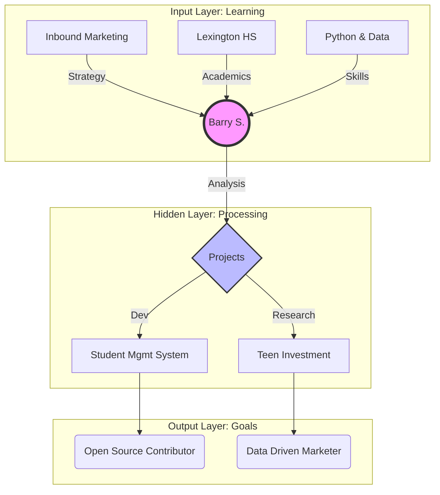

### 🧠 My Neural Network

```mermaid
graph TD
    user((Barry S.))
    
    subgraph "Input Layer: Learning"
        A[Inbound Marketing] -->|Strategy| user
        B[Lexington HS] -->|Academics| user
        C[Python & Data] -->|Skills| user
    end
    
    subgraph "Hidden Layer: Processing"
        user -->|Analysis| D{Projects}
        D -->|Dev| E[Student Mgmt System]
        D -->|Research| F[Teen Investment]
    end
    
    subgraph "Output Layer: Goals"
        E --> G(Open Source Contributor)
        F --> H(Data Driven Marketer)
    end
    
    style user fill:#f9f,stroke:#333,stroke-width:4px
    style D fill:#bbf,stroke:#333,stroke-width:2px
```
